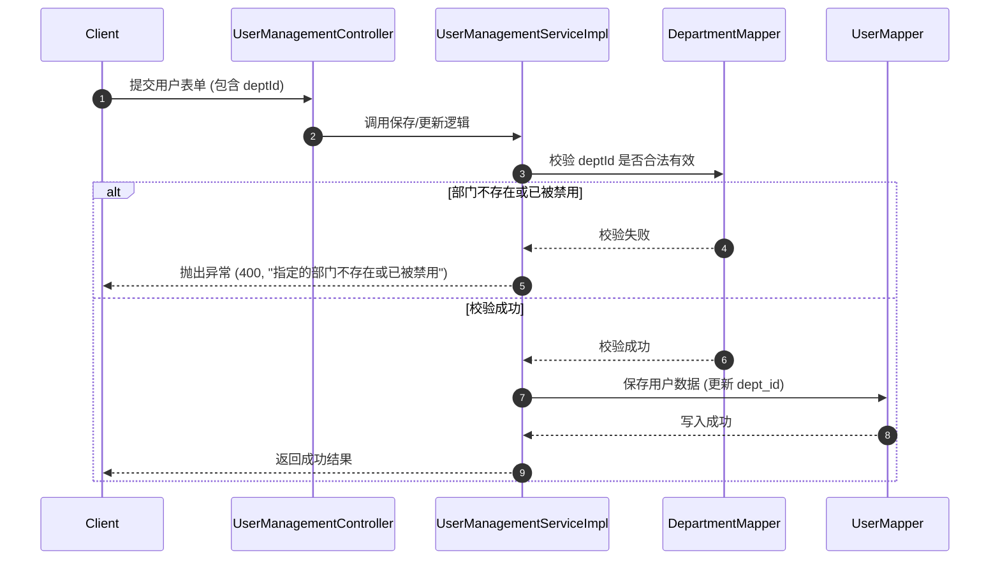

# 部门管理设计方案

## 0. 术语约定

- **部门 (Department)**：系统的组织架构单元，呈树形结构。
- **用户所属部门 (User Department Association)**：用户与部门的关系，每个用户只能属于一个部门（多对一关系）。
- **防冲突结论**：经检索，项目现有代码中不存在 `sys_department` 表或 `Department` 相关的类。我们可以安全地使用该命名。

## 1. 决策与约束

### 需求摘要
- **做什么**：
  1. 新增部门管理功能，支持部门的增删改查（CRUD）及状态启用/禁用。
  2. 在系统管理目录中，将“部门管理”作为二级菜单，并排在“岗位管理”的下方。
  3. 支持为用户分配一个所属部门，并在用户管理列表中展示所属部门名称。
- **成功标准**：
  1. 能够在部门管理页面完成部门的 CRUD 操作，支持层级关系。
  2. 能够在用户管理中为用户指定所属部门，且只能单选。
  3. 用户列表中能正确加载并显示部门名称。
  4. 部门被禁用后，在用户分配部门时不可选。
- **明确不做**：
  1. 本次不做多部门关联（一个用户属于多个部门）。
  2. 不实现复杂的部门级数据权限隔离（仅做基础属性关联展示）。

### 复杂度档位
- 走“全栈增删改查与实体关联”默认档位，无偏离。

### 关键决策
- **决策 1：菜单位置与层级**：将“部门管理”作为二级菜单与“岗位管理”并列，排在其下方。
  - *原因*：当前前端 `Sidebar.vue` 仅支持两级菜单（Catalog 目录 + Menu 菜单），“岗位管理”本身是二级菜单（C 菜单），如果作为其子菜单，现有前端组件无法正确渲染。
- **决策 2：用户与部门关系定义**：在 `sys_user` 表中增加 `dept_id` 字段。
  - *原因*：Many-to-One 关系最简单高效，满足“用户属于某个部门下”的需求。
- **决策 3：级联删除校验**：若部门下存在子部门或存在绑定该部门的用户，则禁止删除。
  - *原因*：保证数据一致性，防止出现悬挂的子部门或无归属关联的脏数据。

### 前置依赖
- 无。

## 2. 名词与编排

### ### 2.1 名词层

#### 现状
- `User` 实体（[User.java](file:///c:/workspace/login-claude-demo/login-boot/src/main/java/com/demo/login/entity/User.java)）承担用户基础信息存储，无部门关联。
- `UserVO` 视图对象（[UserVO.java](file:///c:/workspace/login-claude-demo/login-boot/src/main/java/com/demo/login/vo/UserVO.java)）仅包含基础用户信息，无部门属性。

#### 变化
- **[NEW] `Department` 实体类**：
  对应 `sys_department` 表，包含属性：`id`, `parentId`, `deptName`, `sort`, `status`, `remark` 以及通用审计字段。
- **[MODIFY] `User` 实体类**：
  增加 `private Long deptId` 属性，映射 `sys_user.dept_id`。
- **[MODIFY] `UserVO` 视图对象**：
  增加 `private Long deptId` 和 `private String deptName` 属性。
- **[MODIFY] `CreateUserDTO` / `UpdateUserDTO`**：
  增加 `private Long deptId` 属性，以支持新建/修改用户时指定部门。

#### 接口示例

##### 1. 获取部门列表 (支持名称/状态筛选)
- **请求**：`GET /api/departments`
- **响应**：
```json
{
  "code": 200,
  "message": "success",
  "data": [
    {
      "id": 1,
      "parentId": 0,
      "deptName": "研发中心",
      "sort": 1,
      "status": 1,
      "remark": "集团研发中心"
    }
  ]
}
```

##### 2. 创建部门
- **请求**：`POST /api/departments`
- **请求体**：
```json
{
  "parentId": 0,
  "deptName": "研发中心",
  "sort": 1,
  "status": 1,
  "remark": "集团研发中心"
}
```

##### 3. 删除部门
- **请求**：`DELETE /api/departments/{id}`
- **主要错误响应** (若存在关联用户或子部门)：
```json
{
  "code": 400,
  "message": "该部门下有绑定用户，无法删除",
  "data": null
}
```

##### 4. 前端组件拆分
- **[NEW] `views/system/DeptManagement.vue`**：
  部门管理 CRUD 主页面。表格通过 `row-key="id"` 支持树状展开折叠。
- **[MODIFY] `views/system/UserManagement.vue`**：
  新增或编辑用户时，在表单中挂载 `<el-tree-select>` 组件，允许以树形下拉列表单选部门。

---

### ### 2.2 编排层

#### 主流程图
创建/更新用户并关联部门的流程如下：



#### 现状
- 用户的创建和修改流程不进行关联实体的存在性校验。

#### 变化
- 新增用户或修改用户时，如果传入了 `deptId`，业务层需注入 `DepartmentMapper`，并进行存在性校验与状态校验（只能绑定启用的部门）。

#### 流程级约束
1. **树结构循环引用防护**：编辑部门时，父部门不能选择自己，也不能选择自己的子部门。
2. **状态联动约束**：被禁用的部门在用户编辑下拉框中处于 `disabled` 状态。
3. **可卸载性**：只需移除 `sys_user` 中的 `dept_id` 属性、移除 `DeptManagement.vue` 路由与菜单关联，即可完全卸载此特性。

---

### ### 2.3 挂载点清单

- **数据库脚本**：`c:\workspace\login-claude-demo\data\schema.sql` — 修改（新增 `sys_department` 建表及菜单权限初始化 SQL）
- **前端路由注册**：`c:\workspace\login-claude-demo\login-vue\src\router\index.js` — 修改（注册 `/system/departments` 路由，关联 `DeptManagement.vue`）
- **前端 API 模块**：`c:\workspace\login-claude-demo\login-vue\src\api\dept.js` — 新增（部门 CRUD 封装）
- **部门管理视图**：`c:\workspace\login-claude-demo\login-vue\src\views\system\DeptManagement.vue` — 新增（部门列表及 CRUD 界面）

---

### ### 2.4 推进策略

1. **步骤 1：数据库结构变更与初始化**
   - *退出信号*：执行 SQLite 修改后，`sys_department` 表存在，`sys_user` 新增 `dept_id` 字段，且 `sys_menu` 和 `sys_role_menu` 成功写入部门管理菜单。
2. **步骤 2：后端部门管理 CRUD API**
   - *退出信号*：实现 Department 相关的 Mapper/Service/Controller，通过 REST 接口请求测试确认 CRUD 功能及状态更新可用。
3. **步骤 3：后端用户关联接口适配**
   - *退出信号*：在 User/UserVO 引入 `deptId`/`deptName` 并在查询、新增和更新时正确映射。编写单测验证关联用户逻辑。
4. **步骤 4：前端部门管理功能页面**
   - *退出信号*：在浏览器中能正常访问 `/system/departments` 完成部门的增删改查。
5. **步骤 5：前端用户管理适配与联调**
   - *退出信号*：用户列表展示“所属部门”列；用户编辑弹窗中可用 `el-tree-select` 正确为用户分配部门并成功保存。

---

### ### 2.5 结构健康度与微重构

##### 评估
- **文件级**：`UserManagement.vue` 虽有 1280 行，但本次修改仅涉及一列和一表单项的局部插入，暂无需要拆分的强耦合。
- **目录级**：`views/system` 新增一个页面，且包大小适中，无需重组。
##### 结论
- 本次不做微重构，所有文件布局均符合现有目录约定。

---

## 3. 验收契约

### 关键场景清单
- **场景 1：部门新增与树形展现**
  - *输入/触发*：在部门管理新增“研发中心”(parentId=0)，并在其下新增“前端组”(parentId=研发中心ID)。
  - *期望结果*：部门列表呈现树形级联，均保存成功。
- **场景 2：删除校验（包含子部门）**
  - *输入/触发*：在部门管理尝试直接删除“研发中心”。
  - *期望结果*：弹窗拦截提示“存在子部门，无法删除”。
- **场景 3：删除校验（有绑定用户）**
  - *输入/触发*：将用户 `user` 分配到“前端组”，然后在部门管理尝试删除“前端组”。
  - *期望结果*：弹窗拦截提示“该部门下有绑定用户，无法删除”。
- **场景 4：用户绑定与列表回显**
  - *输入/触发*：编辑用户 `user`，所属部门选择“前端组”并保存。
  - *期望结果*：保存成功，用户表格中 `user` 对应的“所属部门”列回显为“前端组”。

### 明确不做的反向核对项
- 代码中不能出现按用户部门进行数据隔离过滤的 SQL。
- 用户表单中部门选择组件必须是单选（不可启用 multiple 模式）。

---

## 4. 与项目级架构文档的关系

- 待此特性完全上线后，需在 [ARCHITECTURE.md](file:///c:/workspace/login-claude-demo/.codestable/architecture/ARCHITECTURE.md) 中的“3. 子系统 / 模块索引”下追加对“部门管理”模块的简要说明，说明包含部门的 CRUD 和用户-部门的多对一关联。
