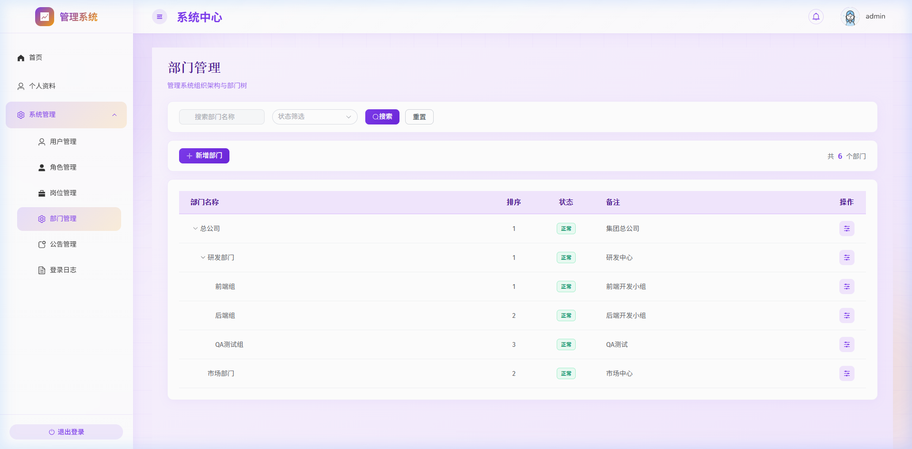
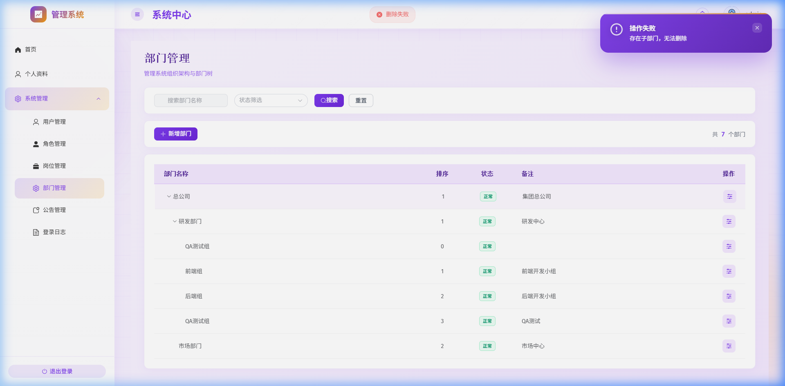
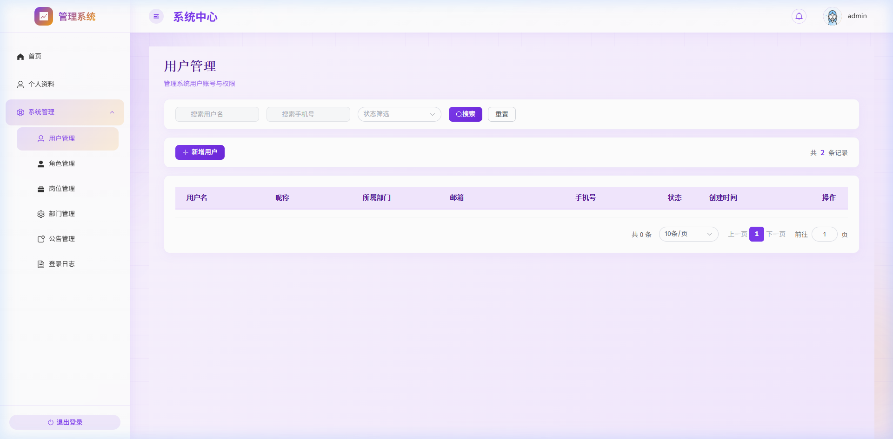

# 部门管理与所属部门配置指南

## 功能简介
**部门管理**是系统组织架构的基础配置模块。它允许系统管理员维护公司的树状层级部门（如总公司 -> 研发中心 -> 前端组），并将系统用户分配到具体的部门中，以便于后续的组织结构展示与业务归属划分。

## 前置条件
- 您需要拥有系统管理员（或包含部门管理、用户管理操作权限）的账号登录系统。
- 部门管理菜单位于：**系统管理 -> 部门管理**，排在“岗位管理”菜单的下方。

---

## 如何使用

### 1. 浏览部门组织架构
登录管理系统后，点击左侧菜单栏的 **“系统管理” -> “部门管理”**。
系统会以树状表格的形式展示当前的组织架构，您可以点击行首的折叠/展开按钮（▶/▼）来查看各级子部门的层级关系。

### 2. 新增部门
1. 点击页面上方的 **“新增”** 按钮（或在具体某行右侧操作栏点击 **“新增”** 以将其设为父部门）。
2. 在弹出的对话框中，填写以下信息：
   - **上级部门**：选择当前新增部门的归属父级。如果不选择或选择根节点，则为一级部门。
   - **部门名称**：必填项，例如“测试组”。
   - **显示顺序**：数值越小，在同级部门中排列越靠前。
   - **部门状态**：默认为“正常”；若设为“停用”，则该部门及其下属部门将无法在用户分配时被选中。
   - **备注**：输入关于该部门的补充说明信息。
3. 点击 **“确定”** 保存。

### 3. 编辑与停用部门
1. 点击目标部门右侧操作栏的 **“编辑”** 按钮。
2. 您可以修改部门名称、排序或切换状态。
3. **安全防环控制**：在选择“上级部门”时，系统已自动将**当前部门本身及其所有子部门**置灰，防止将当前部门移动到自己的子部门下导致系统逻辑陷入死循环。
4. **状态停用联动**：将部门状态切换为“停用”后，该部门在用户分配时将处于不可选状态。

### 4. 删除部门防呆机制
点击目标部门右侧操作栏的 **“删除”** 按钮。为了保护系统数据一致性，系统设有以下安全拦截拦截提示：
- **存在子部门拦截**：若拟删除的部门下还建有子部门，系统会弹出拦截提示并阻止删除。
  
  

- **有关联用户拦截**：若拟删除的部门中仍然有绑定的员工/用户，系统会弹出拦截提示并阻止删除，以防产生无归属的脏用户数据。

> **提示**：若必须删除该部门，请先前往“用户管理”将该部门下的所有用户移交/分配到其他部门，并将该部门下的所有子部门删除或移至其他父部门下。

### 5. 为用户分配所属部门
1. 前往左侧菜单 **“系统管理” -> “用户管理”**。
2. 在用户列表的“所属部门”列中，可以直接查看每个用户当前所属的部门。
3. 点击对应用户右侧操作栏的 **“编辑”** 按钮（或点击上方的 **“新增”** 创建新用户）。
4. 在表单的 **“所属部门”** 项中，点击下拉选择框。系统会弹出一个树状部门选择器。
5. **单选限制**：用户只能选择一个部门。被禁用的部门在下拉树中将呈灰色显示且无法被点击选中。
6. 选择好部门后点击 **“确定”** 保存，列表对应的所属部门即可即时刷新。

---

## 常见问题

### Q1: 为什么在编辑用户时，某些部门在下拉树中是灰色的，无法点击选择？
**A**: 这是因为该部门的状态在“部门管理”中被设置为了**“停用”**。只有处于“正常”状态的部门才可以用来分配给用户。如果需要重新分配，请先前往“部门管理”编辑并启用该部门。

### Q2: 为什么我无法删除某一个没有任何子部门的部门？
**A**: 请检查是否有用户仍属于该部门。您可以通过在“用户管理”列表中筛选或搜索该部门名称，确认是否有员工绑定。只有当该部门下的用户均被重新分配到其他部门后，该部门才可以被安全删除。

### Q3: 为什么在编辑部门的“上级部门”时，部分部门被置灰了？
**A**: 为了防止组织架构产生“自己是自己的子部门”这种逻辑循环，系统会自动把您当前正在编辑的部门以及它的所有下级子部门置灰。您只能选择其他分支部门或顶级部门作为上级部门。

---

## 相关功能
- [用户管理](file:///c:/workspace/login-claude-demo/login-vue/src/views/system/UserManagement.vue)
- [部门管理开发指南](../dev/dept-management.md)
